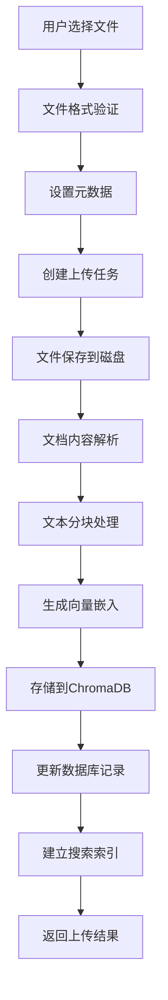
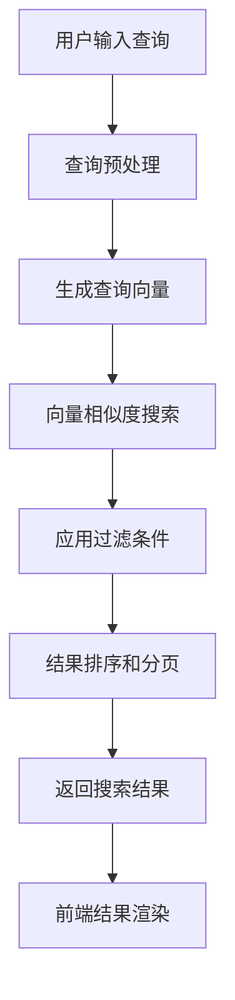
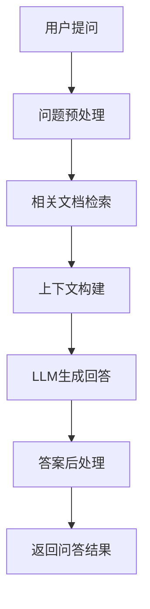

# 知识库管理系统

## 📋 目录

1. [项目概述](#项目概述)
2. [技术栈](#技术栈)
3. [系统架构](#系统架构)
4. [数据库设计](#数据库设计)
5. [业务流程](#业务流程)
6. [API接口设计](#api接口设计)
7. [前端功能模块](#前端功能模块)
8. [部署架构](#部署架构)
9. [监控与日志](#监控与日志)
10. [扩展性设计](#扩展性设计)

---

## 项目概述

### 系统简介
用于管理云服务商的产品技术文档，具备以下特性：
- **多格式支持**: 支持Markdown、PDF、Word、Excel、PowerPoint等多种格式
- **语义搜索**: 基于BGE嵌入模型的语义搜索，理解查询意图
- **文档分类**: 根据云服务商和产品类型分类管理
- **向量化存储**: 使用ChromaDB进行高效的向量存储和检索
- **实时索引**: 文档上传后自动建立索引，支持即时搜索
- **批量处理**: 支持单文件、多文件和文件夹批量上传

---

## 技术栈

### 后端技术栈

#### 核心框架
- **FastAPI**: 现代化Python Web框架，支持异步处理和自动API文档生成
- **Uvicorn**: ASGI服务器，高性能异步HTTP服务器
- **SQLAlchemy**: Python ORM框架，支持多种数据库

#### AI/ML技术
- **FlagEmbedding**: 中文优化的嵌入模型，支持语义搜索
- **ChromaDB**: 开源向量数据库，用于存储和检索文档向量
- **LangChain**: AI应用开发框架，提供文档处理能力
- **Transformers**: Hugging Face模型库

#### 文档处理
- **Unstructured**: 非结构化文档解析库
- **PyPDF**: PDF文档处理
- **python-docx **: Word文档处理
- **openpyxl**: Excel文档处理
- **python-pptx**: PowerPoint文档处理
- **Markdown**: Markdown文档处理


### 前端技术栈

#### 核心框架
- **Vue**: 渐进式JavaScript框架，使用Composition API
- **Vite**: 现代化构建工具，快速开发和构建
- **Vue Router**: 官方路由管理器

#### UI组件库
- **Element Plus**: 基于Vue 3的组件库
- **@element-plus/icons-vue**: Element Plus图标库

#### 状态管理
- **Pinia**: Vue 3官方推荐的状态管理库

#### HTTP客户端
- **Axios**: Promise-based HTTP客户端

#### 样式处理
- **SCSS**: CSS预处理器
- **Sass**: SCSS编译器

#### 其他工具
- **NProgress**: 页面加载进度条

---

## 系统架构

### 整体架构图

```
┌─────────────────────────────────────────────────────────────────┐
│                        前端层 (Frontend)                         │
├─────────────────────────────────────────────────────────────────┤
│  Vue 3 + Element Plus + Pinia + Vue Router                      │
│  ┌─────────────┐ ┌─────────────┐ ┌─────────────┐ ┌─────────────┐│
│  │   仪表盘     │ │  文档上传    │ │  知识搜索     │ │  文档管理    ││
│  └─────────────┘ └─────────────┘ └─────────────┘ └─────────────┘│
└─────────────────────────────────────────────────────────────────┘
                                │
                                │ HTTP/HTTPS
                                ▼
┌─────────────────────────────────────────────────────────────────┐
│                        API网关层 (Gateway)                       │
├─────────────────────────────────────────────────────────────────┤
│  FastAPI + Uvicorn + CORS + 认证中间件                            │
│  ┌─────────────┐ ┌─────────────┐ ┌─────────────┐ ┌─────────────┐│
│  │  请求路由    │ │  认证授权     │ │  参数验证    │ │  错误处理    ││
│  └─────────────┘ └─────────────┘ └─────────────┘ └─────────────┘│
└─────────────────────────────────────────────────────────────────┘
                                │
                                ▼
┌─────────────────────────────────────────────────────────────────┐
│                      业务逻辑层 (Business Logic)                  │
├─────────────────────────────────────────────────────────────────┤
│  ┌─────────────┐ ┌─────────────┐ ┌─────────────┐ ┌─────────────┐│
│  │ 文档处理服务  │ │ 搜索引擎服务  │ │ 向量存储服务  │ │ 健康检查服务  ││
│  └─────────────┘ └─────────────┘ └─────────────┘ └─────────────┘│
└─────────────────────────────────────────────────────────────────┘
                                │
                                ▼
┌─────────────────────────────────────────────────────────────────┐
│                       数据存储层 (Data Storage)                   │
├─────────────────────────────────────────────────────────────────┤
│  ┌─────────────┐ ┌─────────────┐ ┌─────────────┐ ┌─────────────┐│
│  │  SQLite     │ │  ChromaDB   │ │  文件系统    │ │   日志文件    ││
│  │  (元数据)    │ │  (向量存储)  │ │  (原始文档)   │ │  (系统日志)  ││
│  └─────────────┘ └─────────────┘ └─────────────┘ └─────────────┘│
└─────────────────────────────────────────────────────────────────┘
```

### 模块化架构

#### 后端模块结构

knowledge-base-api/
├── app/                          # 应用核心代码
│   ├── main.py                   # 应用入口点
│   ├── api/                      # API路由层
│   │   └── v1/                   # API版本控制
│   │       ├── a2a.py            # a2a端点
│   │       ├── admin.py          # 管理API
│   │       └── knowledge.py      # 知识库API
│   ├── core/                     # 核心配置
│   │   ├── config.py             # 配置管理
│   │   ├── database.py           # 数据库配置
│   │   └── logging.py            # 日志配置
│   ├── models/                   # 数据模型
│   │   ├── document.py           # 文档模型
│   │   └── search.py             # 搜索模型
│   ├── services/                 # 业务服务层
│   │   ├── a2a_service.py        # a2a服务
│   │   ├── document_processor.py # 文档处理服务
│   │   ├── vector_store.py       # 向量存储服务
│   │   ├── search_engine.py      # 搜索引擎服务
│   │   ├── qa_service.py         # 问答服务
│   │   └── health_service.py     # 健康检查服务
│   └── utils/                    # 工具函数
├── data/                         # 数据目录
│   ├── documents/                # 原始文档存储
│   ├── processed/                # 处理后数据
│   └── vectors/                  # 向量数据
└── scripts/                      # 脚本工具


#### 前端模块结构

knowledge-base-frontend/
├── src/
│   ├── App.vue                   # 根组件
│   ├── main.js                   # 应用入口
│   ├── router/                   # 路由配置
│   │   └── index.js
│   ├── stores/                   # 状态管理
│   │   ├── api.js                # API状态
│   │   └── dashboard.js          # 仪表盘状态
│   ├── services/                 # API服务
│   │   └── api.js                # 统一API客户端
│   ├── views/                    # 页面组件
│   │   ├── Dashboard.vue         # 仪表盘
│   │   ├── Upload.vue            # 文档上传
│   │   ├── Search.vue            # 知识搜索
│   │   ├── Documents.vue         # 文档管理
│   │   └── Settings.vue          # 系统设置
│   ├── components/               # 通用组件
│   ├── config/                   # 配置文件
│   │   └── env.js                # 环境配置
│   └── utils/                    # 工具函数
└── dist/                         # 构建输出


---

## 数据库设计

### 关系型数据库 (SQLite)

#### 文档表 (documents)
```sql
CREATE TABLE documents (
    id INTEGER PRIMARY KEY AUTOINCREMENT,
    title VARCHAR(500) NOT NULL,                    -- 文档标题
    filename VARCHAR(255) NOT NULL UNIQUE,         -- 文件名
    file_path VARCHAR(1000) NOT NULL,              -- 文件路径
    content TEXT,                                   -- 文档内容
    content_hash VARCHAR(64),                      -- 内容哈希
    
    -- 元数据字段
    source_url VARCHAR(1000),                       -- 源链接
    provider VARCHAR(100),                         -- 云服务商
    category VARCHAR(100),                         -- 产品分类
    tags JSON,                                     -- 标签
    doc_metadata JSON,                            -- 扩展元数据
    
    -- 状态字段
    status VARCHAR(20) DEFAULT 'pending',          -- 处理状态
    file_size INTEGER,                            -- 文件大小
    word_count INTEGER,                           -- 词数统计
    
    -- 索引状态
    vector_indexed BOOLEAN DEFAULT FALSE,          -- 向量索引状态
    search_indexed BOOLEAN DEFAULT FALSE,         -- 搜索索引状态
    
    -- 时间戳
    created_at DATETIME DEFAULT CURRENT_TIMESTAMP,
    updated_at DATETIME DEFAULT CURRENT_TIMESTAMP,
    processed_at DATETIME                          -- 处理完成时间
);

-- 索引
CREATE INDEX idx_documents_provider ON documents(provider);
CREATE INDEX idx_documents_category ON documents(category);
CREATE INDEX idx_documents_status ON documents(status);
CREATE INDEX idx_documents_vector_indexed ON documents(vector_indexed);
CREATE INDEX idx_documents_content_hash ON documents(content_hash);
```

#### 文档状态枚举
```python
class DocumentStatus(str, Enum):
    PENDING = "pending"        # 待处理
    PROCESSING = "processing" # 处理中
    PROCESSED = "processed"   # 已处理
    FAILED = "failed"         # 处理失败
```

### 向量数据库 (ChromaDB)

#### 集合结构
```python
collection_name = "knowledge_base"
collection_metadata = {
    "description": "Knowledge base document chunks",
    "embedding_model": "BAAI/bge-small-zh",
    "embedding_dimension": 512
}
```

#### 向量存储字段
```python
# 每个文档块的向量存储结构
{
    "id": "doc_{document_id}_chunk_{chunk_index}",  # 唯一标识
    "embedding": [0.1, 0.2, ...],                   # 512维向量
    "document": "chunk content",                    # 文本内容
    "metadata": {
        "document_id": 1,                          # 文档ID
        "chunk_index": 0,                          # 块索引
        "start_pos": 0,                            # 起始位置
        "end_pos": 1000,                           # 结束位置
        "word_count": 150,                         # 词数
        "title": "文档标题",                        # 文档标题
        "provider": "阿里云",                       # 云服务商
        "category": "负载均衡",                     # 产品分类
        "source_url": "https://...",               # 源链接
        "filename": "document.md"                  # 文件名
    }
}
```

### 文件系统存储

#### 目录结构
```
data/
├── documents/                    # 原始文档存储
│   ├── 阿里云/
│   │   ├── 负载均衡/
│   │   │   ├── ALB/
│   │   │   │   ├── 什么是ALB.md
│   │   │   │   └── ALB配置.md
│   │   │   └── CLB/
│   │   └── 私有网络/
│   ├── 腾讯云/
│   │   ├── 负载均衡/
│   │   └── 私有网络/
│   └── AWS/
├── processed/                    # 处理后数据缓存
└── vectors/                      # ChromaDB数据文件
    ├── chroma.sqlite3
    └── {collection_id}/
        ├── data_level0.bin
        ├── header.bin
        └── index_metadata.pickle
```

---

## 业务流程

### 1. 文档上传流程



#### 详细步骤说明

1. **文件接收**: 前端上传文件到后端API
2. **格式验证**: 检查文件格式和大小限制
3. **元数据提取**: 从文件路径和内容中提取元数据
4. **文件存储**: 保存原始文件到指定目录结构
5. **内容解析**: 使用LangChain解析文档内容
6. **文本分块**: 将长文档分割成文本块
7. **向量化**: 使用BGE模型生成文本块向量
8. **向量存储**: 将向量和元数据存储到ChromaDB
9. **数据库更新**: 更新SQLite中的文档记录
10. **索引建立**: 建立搜索索引，可以即时搜索

### 2. 搜索查询流程



#### 详细步骤说明

1. **查询接收**: 接收用户搜索查询和过滤条件
2. **查询预处理**: 清理和标准化查询文本
3. **向量生成**: 使用BGE模型生成查询向量
4. **相似度搜索**: 在ChromaDB中执行向量相似度搜索
5. **结果过滤**: 根据提供商、分类等条件过滤结果
6. **相似度计算**: 计算L2距离并转换为相似度分数
7. **结果排序**: 按相似度分数降序排列
8. **分页处理**: 应用偏移和限制参数
9. **结果返回**: 返回格式化的搜索结果
10. **UI渲染**: 前端渲染搜索结果和高亮显示

### 3. 问答处理流程



#### 详细步骤说明

1. **问题接收**: 接收用户问题和相关参数
2. **问题分析**: 分析问题类型和意图
3. **文档检索**: 使用语义搜索找到相关文档
4. **上下文构建**: 构建包含相关文档的上下文
5. **答案生成**: 调用LLM生成回答
6. **答案验证**: 验证答案质量和相关性
7. **来源标注**: 标注答案来源文档
8. **结果返回**: 返回格式化的问答结果

---

## API接口设计

### RESTful API规范

#### 基础URL
```
生产环境: https://api.example.com/api/v1
开发环境: http://localhost:8000/api/v1
```

### 知识库API

#### 1. 搜索接口
```http
GET /api/v1/knowledge/search
```

**请求参数:**
```json
{
  "query": "负载均衡配置",
  "limit": 10,
  "offset": 0,
  "provider": "阿里云",
  "category": "负载均衡",
  "min_score": 0.5
}
```

**响应格式:**
```json
{
  "total": 25,
  "results": [
    {
      "id": 1,
      "title": "阿里云ALB配置指南",
      "content": "Application Load Balancer (ALB) 是阿里云...",
      "source": "阿里云/负载均衡/ALB/配置指南.md",
      "score": 0.95,
      "metadata": {
        "provider": "阿里云",
        "category": "负载均衡",
        "source_url": "https://help.aliyun.com/..."
      }
    }
  ],
  "query": "负载均衡配置",
  "search_type": "semantic",
  "processing_time": 0.156
}
```

#### 2. 文本摘要接口
```http
POST /api/v1/knowledge/summarize
```

**请求体:**
```json
{
  "document_id": 1,
  "summary_type": "brief",
  "max_length": 200
}
```

#### 3. 统计信息接口
```http
GET /api/v1/knowledge/stats
```

**响应格式:**
```json
{
  "vector_store": {
    "total_chunks": 1250,
    "total_documents": 156,
    "providers": ["阿里云", "腾讯云", "AWS"],
    "categories": ["负载均衡", "私有网络"],
    "provider_distribution": {
      "阿里云": {"count": 500, "percentage": 40.0},
      "腾讯云": {"count": 400, "percentage": 32.0}
    }
  },
  "last_updated": 1703123456.789
}
```

### 管理API

#### 1. 文档上传接口
```http
POST /api/v1/admin/documents/upload
Content-Type: multipart/form-data
```

**请求体:**
```
file: <binary_file_data>
provider: 阿里云
category: 负载均衡
title: 文档标题
relative_path: subfolder/document.md
```

**响应格式:**
```json
{
  "message": "Document uploaded successfully",
  "filename": "document.md",
  "document_id": "123",
  "title": "文档标题",
  "provider": "阿里云",
  "category": "负载均衡",
  "size": "1024",
  "word_count": "150"
}
```

#### 2. 文档列表接口
```http
GET /api/v1/admin/documents
```

**请求参数:**
```json
{
  "skip": 0,
  "limit": 20,
  "provider": "阿里云",
  "category": "负载均衡",
  "doc_status": "processed"
}
```

#### 3. 文档删除接口
```http
DELETE /api/v1/admin/documents/{document_id}
```

#### 4. 重建索引接口
```http
POST /api/v1/admin/reindex
```

#### 5. 健康检查接口
```http
GET /api/v1/admin/health
```

**响应格式:**
```json
{
  "status": "healthy",
  "timestamp": 1703123456.789,
  "version": "1.0.0",
  "components": {
    "database": {
      "status": "healthy",
      "response_time": 0.001
    },
    "vector_store": {
      "status": "healthy",
      "collection_count": 1,
      "total_chunks": 1250
    },
    "embedding_model": {
      "status": "healthy",
      "model_name": "BAAI/bge-small-zh",
      "dimension": 512
    }
  }
}
```

#### 6. 系统指标接口
```http
GET /api/v1/admin/metrics
```

---

## 前端功能模块

### 1. 仪表盘模块 (Dashboard)

#### 功能特性
- **系统概览**: 显示文档总数、文本块数、云服务商数量
- **数据统计**: 实时展示知识库统计信息
- **云服务商分布**: 可视化展示各云服务商的文档分布
- **快速操作**: 提供常用功能的快捷入口

#### 技术实现
```vue
<template>
  <div class="dashboard-page">
    <!-- 统计卡片 -->
    <el-row :gutter="24" class="stats-row">
      <el-col :span="8">
        <div class="stat-card">
          <div class="stat-icon">
            <el-icon><Document /></el-icon>
          </div>
          <div class="stat-content">
            <div class="stat-label">文档总数</div>
            <div class="stat-number">{{ stats.total_documents }}</div>
          </div>
        </div>
      </el-col>
    </el-row>
    
    <!-- 云服务商分布 -->
    <div class="providers-card">
      <div v-for="provider in stats.providers" :key="provider">
        <el-progress 
          :percentage="getProviderPercentage(provider)"
          :color="getProviderColor(provider)"
        />
      </div>
    </div>
  </div>
</template>
```

#### 状态管理
```javascript
// stores/dashboard.js
export const useDashboardStore = defineStore('dashboard', {
  state: () => ({
    stats: {},
    isLoading: false,
    hasError: false,
    errorMessage: '',
    lastUpdated: null
  }),
  
  actions: {
    async fetchStats(forceRefresh = false) {
      // 获取统计数据的逻辑
    },
    
    getProviderPercentage(provider) {
      // 计算提供商百分比
    }
  }
})
```

### 2. 文档上传模块 (Upload)

#### 功能特性
- **多格式支持**: 支持.md, .doc, .docx, .pdf, .txt, .xlsx, .xls, .pptx, .ppt
- **批量上传**: 支持单文件、多文件和文件夹批量上传
- **元数据设置**: 支持设置云服务商、产品分类等元数据
- **上传队列**: 支持多个上传任务并行处理
- **进度跟踪**: 实时显示上传进度和结果

#### 技术实现
```vue
<template>
  <div class="upload-page">
    <!-- 元数据设置 -->
    <div class="metadata-section">
      <el-form-item label="云服务商" required>
        <el-select v-model="documentMetadata.provider">
          <el-option label="阿里云" value="阿里云" />
          <el-option label="腾讯云" value="腾讯云" />
        </el-select>
      </el-form-item>
    </div>
    
    <!-- 文件上传区域 -->
    <el-upload
      ref="uploadRef"
      drag
      :action="uploadUrl"
      :data="uploadData"
      :before-upload="beforeUpload"
      :on-success="onUploadSuccess"
      multiple
    >
      <el-icon><upload-filled /></el-icon>
      <div>将文件拖到此处，或点击上传</div>
    </el-upload>
    
    <!-- 上传任务列表 -->
    <div class="upload-tasks">
      <div v-for="task in uploadTasks" :key="task.id">
        <el-progress :percentage="task.progress" />
      </div>
    </div>
  </div>
</template>
```

#### 上传流程
1. **文件选择**: 用户选择文件或文件夹
2. **格式验证**: 检查文件格式和大小
3. **元数据设置**: 设置云服务商和分类
4. **创建任务**: 创建上传任务并加入队列
5. **并行上传**: 多个文件并行上传处理
6. **进度跟踪**: 实时更新上传进度
7. **结果处理**: 显示上传结果和错误信息

### 3. 知识搜索模块 (Search)

#### 功能特性
- **语义搜索**: 基于BGE模型的智能语义搜索
- **高级过滤**: 支持按云服务商、产品分类过滤
- **相似度控制**: 可调节最小相似度阈值
- **结果高亮**: 搜索结果关键词高亮显示
- **分页支持**: 支持大量结果的分页浏览

#### 技术实现
```vue
<template>
  <div class="search-page">
    <!-- 搜索表单 -->
    <el-form :model="searchForm" @submit.prevent="handleSearch">
      <el-input
        v-model="searchForm.query"
        placeholder="请输入搜索关键词..."
        @keyup.enter="handleSearch"
      />
      
      <el-select v-model="searchForm.provider" placeholder="选择云服务商">
        <el-option label="阿里云" value="阿里云" />
        <el-option label="腾讯云" value="腾讯云" />
      </el-select>
      
      <el-button type="primary" @click="handleSearch">搜索</el-button>
    </el-form>
    
    <!-- 搜索结果 -->
    <div v-for="result in searchResults" :key="result.id">
      <div class="result-title">{{ result.title }}</div>
      <div class="result-content">{{ result.content }}</div>
      <div class="result-meta">
        <el-tag>{{ result.metadata.provider }}</el-tag>
        <span class="result-score">相似度: {{ (result.score * 100).toFixed(1) }}%</span>
      </div>
    </div>
  </div>
</template>
```

#### 搜索流程
1. **查询构建**: 构建搜索参数和过滤条件
2. **API调用**: 调用后端搜索接口
3. **结果处理**: 处理搜索结果和元数据
4. **UI渲染**: 渲染搜索结果和高亮显示
5. **交互反馈**: 提供用户交互和操作反馈

### 4. 文档管理模块 (Documents)

#### 功能特性
- **文档列表**: 展示所有已上传的文档
- **分类筛选**: 按云服务商、分类、状态筛选
- **批量操作**: 支持批量删除、重新索引等操作
- **详情查看**: 查看文档详细信息和内容
- **状态管理**: 显示文档处理状态和索引状态

### 5. 系统设置模块 (Settings)

#### 功能特性
- **API配置**: 配置API密钥和连接参数
- **系统参数**: 调整系统运行参数
- **数据管理**: 数据备份、清理、重建索引
- **系统监控**: 查看系统运行状态和性能指标

---

## 部署架构

### 开发环境部署

#### 后端部署
```bash
# 1. 环境准备
cd knowledge-base-api

# 2. 依赖安装
pip install -r requirements.txt

# 3. 数据库初始化
python scripts/init_db.py

# 4. 启动服务
python run_dev.py
# 或
uvicorn app.main:app --reload --host 0.0.0.0 --port 8000
```

#### 前端部署
```bash
# 1. 环境准备
cd knowledge-base-frontend
npm install

# 2. 开发服务器
npm run dev

# 3. 构建生产版本
npm run build
```

---

## 监控与日志

### 1. 日志系统

#### 结构化日志
```python
import logging
import json
from datetime import datetime

class StructuredLogger:
    def __init__(self, name: str):
        self.logger = logging.getLogger(name)
        self.logger.setLevel(logging.INFO)
        
        # JSON格式处理器
        json_handler = logging.FileHandler('logs/app.log')
        json_formatter = logging.Formatter(
            '%(asctime)s - %(name)s - %(levelname)s - %(message)s'
        )
        json_handler.setFormatter(json_formatter)
        self.logger.addHandler(json_handler)
    
    def log_request(self, request_id: str, method: str, url: str, 
                   status_code: int, duration: float):
        log_data = {
            "timestamp": datetime.utcnow().isoformat(),
            "type": "request",
            "request_id": request_id,
            "method": method,
            "url": str(url),
            "status_code": status_code,
            "duration": duration
        }
        self.logger.info(json.dumps(log_data))
    
    def log_error(self, error: Exception, context: str = ""):
        log_data = {
            "timestamp": datetime.utcnow().isoformat(),
            "type": "error",
            "error_type": type(error).__name__,
            "error_message": str(error),
            "context": context
        }
        self.logger.error(json.dumps(log_data))
```

#### 性能监控
```python
import time
from functools import wraps

def monitor_performance(func):
    @wraps(func)
    async def wrapper(*args, **kwargs):
        start_time = time.time()
        try:
            result = await func(*args, **kwargs)
            duration = time.time() - start_time
            
            # 记录性能日志
            logger.log_performance(
                function_name=func.__name__,
                duration=duration,
                status="success"
            )
            return result
        except Exception as e:
            duration = time.time() - start_time
            logger.log_performance(
                function_name=func.__name__,
                duration=duration,
                status="error",
                error=str(e)
            )
            raise
    return wrapper
```

### 2. 健康检查

#### 系统健康监控
```python
class HealthService:
    def __init__(self, vector_store: VectorStore):
        self.vector_store = vector_store
    
    def get_health_status(self) -> dict:
        health_status = {
            "status": "healthy",
            "timestamp": time.time(),
            "version": settings.APP_VERSION,
            "components": {}
        }
        
        # 数据库健康检查
        db_status = self._check_database()
        health_status["components"]["database"] = db_status
        
        # 向量存储健康检查
        vector_status = self._check_vector_store()
        health_status["components"]["vector_store"] = vector_status
        
        # 嵌入模型健康检查
        model_status = self._check_embedding_model()
        health_status["components"]["embedding_model"] = model_status
        
        # 整体状态判断
        if any(comp["status"] != "healthy" for comp in health_status["components"].values()):
            health_status["status"] = "unhealthy"
        
        return health_status
    
    def _check_database(self) -> dict:
        try:
            start_time = time.time()
            db = next(get_db())
            db.execute("SELECT 1")
            response_time = time.time() - start_time
            
            return {
                "status": "healthy",
                "response_time": round(response_time, 3)
            }
        except Exception as e:
            return {
                "status": "unhealthy",
                "error": str(e)
            }
```

### 3. 指标收集

#### 业务指标
```python
class MetricsCollector:
    def __init__(self):
        self.metrics = {
            "requests_total": 0,
            "requests_duration": [],
            "search_queries": 0,
            "documents_uploaded": 0,
            "errors_total": 0
        }
    
    def increment_counter(self, metric_name: str, value: int = 1):
        if metric_name in self.metrics:
            self.metrics[metric_name] += value
    
    def record_duration(self, duration: float):
        self.metrics["requests_duration"].append(duration)
        # 保持最近1000个记录
        if len(self.metrics["requests_duration"]) > 1000:
            self.metrics["requests_duration"] = self.metrics["requests_duration"][-1000:]
    
    def get_metrics_summary(self) -> dict:
        durations = self.metrics["requests_duration"]
        return {
            "total_requests": self.metrics["requests_total"],
            "avg_duration": sum(durations) / len(durations) if durations else 0,
            "max_duration": max(durations) if durations else 0,
            "search_queries": self.metrics["search_queries"],
            "documents_uploaded": self.metrics["documents_uploaded"],
            "error_rate": self.metrics["errors_total"] / max(self.metrics["requests_total"], 1)
        }
```

---

## 扩展性设计

### 1. 水平扩展

#### 负载均衡
```nginx
upstream backend_servers {
    server backend1:8000 weight=3;
    server backend2:8000 weight=3;
    server backend3:8000 weight=2;
    server backend4:8000 weight=2;
}

server {
    location /api/ {
        proxy_pass http://backend_servers;
        proxy_set_header Host $host;
        proxy_set_header X-Real-IP $remote_addr;
    }
}
```

### 2. 数据库扩展

#### 读写分离
```python
class DatabaseManager:
    def __init__(self):
        self.write_engine = create_engine(settings.WRITE_DATABASE_URL)
        self.read_engine = create_engine(settings.READ_DATABASE_URL)
    
    def get_write_session(self):
        return sessionmaker(bind=self.write_engine)()
    
    def get_read_session(self):
        return sessionmaker(bind=self.read_engine)()
```

#### 分库分表
```python
class ShardedDocumentManager:
    def __init__(self):
        self.shards = {
            'shard_1': create_engine('sqlite:///shard_1.db'),
            'shard_2': create_engine('sqlite:///shard_2.db'),
            'shard_3': create_engine('sqlite:///shard_3.db')
        }
    
    def get_shard(self, document_id: int):
        shard_key = document_id % len(self.shards)
        return self.shards[f'shard_{shard_key + 1}']
```

### 3. 缓存扩展

#### 多级缓存
```python
class CacheManager:
    def __init__(self):
        self.l1_cache = {}  # 内存缓存
        self.l2_cache = redis.Redis()  # Redis缓存
        self.l3_cache = None  # 分布式缓存
    
    async def get(self, key: str):
        # L1缓存
        if key in self.l1_cache:
            return self.l1_cache[key]
        
        # L2缓存
        value = self.l2_cache.get(key)
        if value:
            self.l1_cache[key] = value
            return value
        
        return None
    
    async def set(self, key: str, value: str, ttl: int = 300):
        self.l1_cache[key] = value
        self.l2_cache.setex(key, ttl, value)
```

### 4. 插件系统

#### 插件接口
```python
from abc import ABC, abstractmethod

class DocumentProcessorPlugin(ABC):
    @abstractmethod
    def can_process(self, file_path: str) -> bool:
        pass
    
    @abstractmethod
    def process(self, file_path: str) -> dict:
        pass

class PluginManager:
    def __init__(self):
        self.plugins = []
    
    def register_plugin(self, plugin: DocumentProcessorPlugin):
        self.plugins.append(plugin)
    
    def process_document(self, file_path: str):
        for plugin in self.plugins:
            if plugin.can_process(file_path):
                return plugin.process(file_path)
        return None
```

---